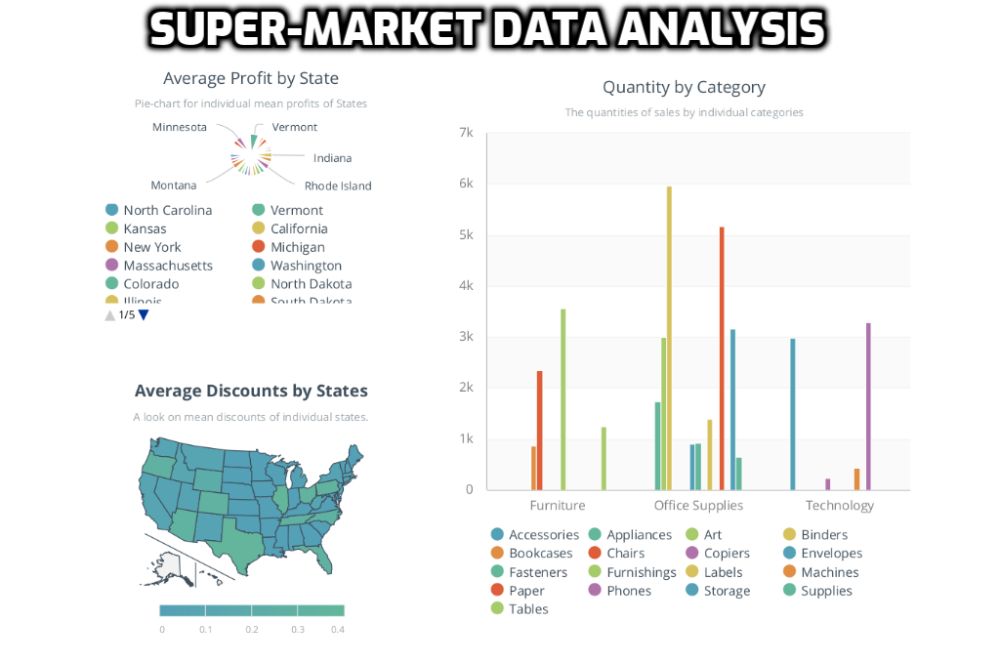
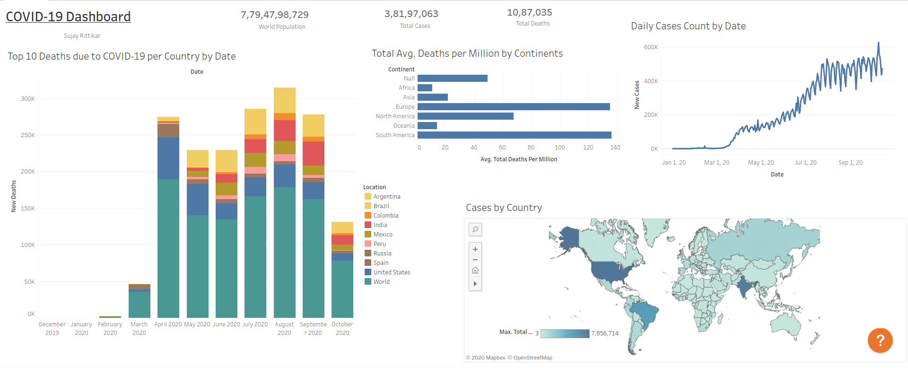

# TSF
The Sparks Foundation Internship Problems:

## Prediction using Supervised Machine Learning: 
Predict the percentage of marks of an student based on the number of
study hours.
In this we Predicted the percentage of an student based on the no.of study hours it's a simple linear regression task it invloves just 2 variables, R, Python, SAS Enterprise Miner this tools we used in this task. 
Data can be found at : http://bit.ly/w-data

## Prediction using Unsupervised Machine Learning: 
From the given ‘Iris’ dataset, and in this I'm used Python and predicted the optimum number of clusters and
represent it visually.
In this we used ‘Iris’ dataset, and Predicted the optimum number of clusters and also
represented it visually.
Data can be found at : https://bit.ly/3kXTdox

## Exploratory Data Analysis - Retail:
Perform ‘Exploratory Data Analysis’ on the provided dataset ‘SampleSuperstore’.
In this Exploratory Data Analysis using python tool we found the weak areas where we can work to make more profit. 
Data can be found at : https://bit.ly/3i4rbWl

## Prediction using Decision Tree Algorithm: 
For the given ‘Iris’ dataset, create the Decision Tree classifier and visualize it
graphically.
The Purpose of Decision Tree Algorithm is if we feed any new data to this classifier , it would be able to predict the right class  accordingly, using  ‘Iris’ dataset, and created the Decision Tree classifier and also
visualized it graphically.
Data can be found at : https://bit.ly/3kXTdox

## Stock Market Prediction using Numerical and Textual Analysis:
Create a hybrid model for stock price/performance prediction using numerical analysis of historical stock prices, and sentimental analysis of news headlines.
In this we Created a hybrid model for stock price/performance prediction using numerical analysis of historical stock prices, and sentimental analysis of news headlines and also predicted the stock price and analyzed the historical stock prices.

### Timeline Analysis: Covid-19
In this task we Created a dashboard showing spread of Covid-19 cases in your country or any
region and also we Identifyed interesting patterns and possible reasons  helping Covid-19 spread with basis as well as advanced charts at the end Screen-recorded and completed storyboard along with given recommendations.

